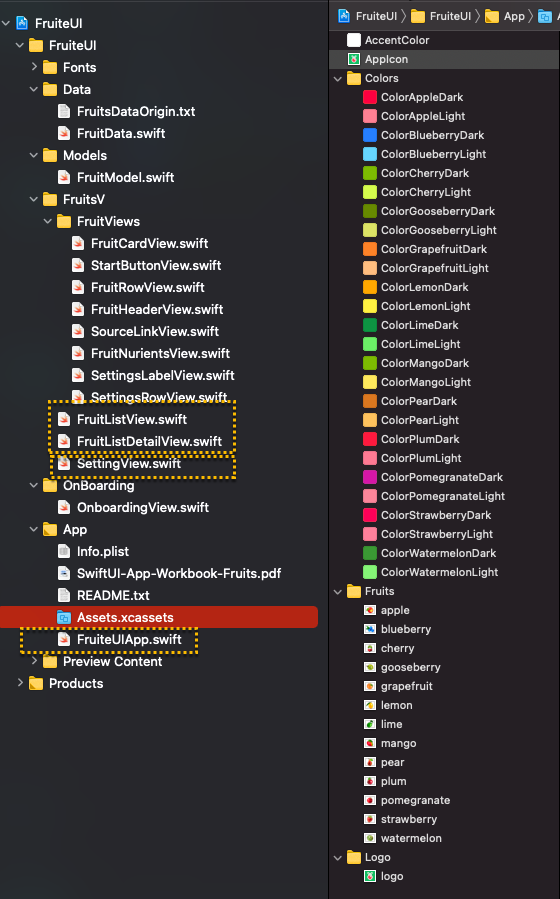
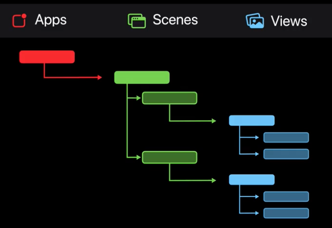

# SwiftUI Exercising
1. Making some simple UIs using swiftUI
    - Images and color sets in the assets are very important to enhence user experience

2. Through this example project, being able to be familiar with Swiftui syntax
    - App -> Scenes -> Views 구조

3. 미리보기
[Youtube](https://youtu.be/Q9MIvUvMXTo "미리보기")
